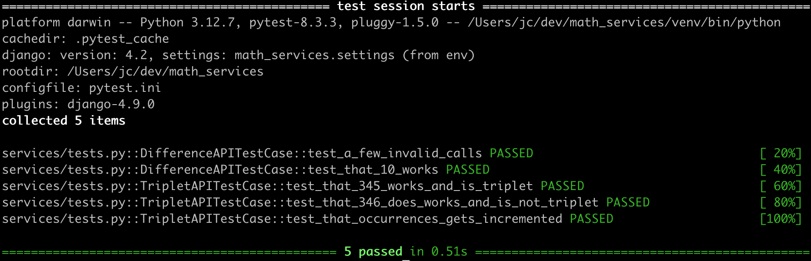

# math_services
Math Services for BackStage

## How to Launch Math_Services

1. Checkout this repo into a new folder

    The following command will check this repo out into a new folder called math_services:

    ```bash
    git clone git@github.com:JamieCzuy/math_services.git
    ```

2. Go into the new folder, create and activate a virtual environment in which to work on this repo:

    ```bash
    cd math_services
    python -m venv venv
    source ./venv/bin/activate
    ```

    You should see your prompt has changed to include `(venv)`

3. Use pip to load the required python packages defined in `requirements.txt`:

    ```bash
    pip install -y requirements.txt
    ```

4. Use `./manage.py` to run the `runserver` Django management command:

    ```bash
    ./manage.py runserver 0.0.0.0:8000
    ```

    This makes the django app available at `http://localhost:8000`

    TODO: Create a UI landing page

5. Access the math services:

    1. Sum of Squares vs Square of Sums at: http://localhost:8000/difference?number=n
    2. Pythagorean Triplets at http://localhost:8000/triplet?a=a&b=b&c=c

6. If you'd like to rebuild the database there is a new management command to do that:

    ```bash
    ./manage.py initialize_database
    ```

    Note: there is a optional `--force` flag that is required if there is already data in the database.

## How to Test Math_Services Using pytest

1. Pytest is installed in the virtual environment (it is in requirements.txt) so if you have
that environment activated all you need to do to run the unit tests is:

    ```bash
    pytest
    ```

    You should see:
    

## How to Test Math_Services Using curl

Once the math_services are up and running you can use the browser or curl to test the endpoints.

Here are some curl commands to show how the service is working
(Note: jq makes the output much more readable but if you do not
have jq installed leave off the `| jq .`)

1. Difference call that works:

    ```bash
    curl -sS  -H "Accept: application/json" http://localhost:8000/difference/\?number\=10 | jq .
    ```

2. Difference call that fails (trying to use n instead of number):

    ```bash
    curl -sS  -H "Accept: application/json" http://localhost:8000/difference/\?n\=10 | jq .
    ```

3. Triplet call that works:

    ```bash
    curl -sS  -H "Accept: application/json" http://localhost:8000/triplet/\?a\=3\&b\=4&c=5 | jq .
    ```

4. Triplet call that fails (not passing in the c param):

    ```bash
    curl -sS  -H "Accept: application/json" http://localhost:8000/triplet/\?a\=3\&b\=4 | jq .
    ```

## Questions

1. Is this to be a purely public service (or is user authentication required)?
    - Right now I am going to assume that it is a public service

2. Should the Database (sqlite3 file) be included in the repo?
    - Yes a pre-populated Sqlite3 database file should be included
    - But also the user should be able to rebuild it.

## Assumptions

1. Can use Python 3.12.7 (one of the latest versions of Python)

2. Can use Django 4.2 (one of the latest LTS versions of Django)

3. It is ok to not split out the Dev requirements into their own file

4. The types for the different values in the response are not defined. Here are my assumptions:

    For difference:
        "datetime" - String (representing a Timezone aware timestamp)
        "value" - Integer
        "number" - Integer
        "occurrences" - Integer
        "last_datetime" - String (representing a Timezone aware timestamp)

    TODO: For triplets:
        "datetime" - String (representing a Timezone aware timestamp)
        "value" - Integer
        "a, b, and c" - Integer
        "is_triplet" - Boolean
        "product" - Integer
        "occurrences" - Integer
        "last_datetime" - String (representing a Timezone aware timestamp)

5. There are no requirements around error handling so here are my assumptions:
    1. For the /difference endpoint:
        If n is not given  or n > 100 or n is not an integer return a 400 Bad Request with a message about n is required and required to be an integer between 0 and 100.

6. Assuming last_requested can be None, representing a number that has never been requested. Means can't use `auto_now`.

## Considerations

1. To make it easier to run: the django project was created in the root of the repo. It would usually be created in a subfolder, something like ./src.

2. For the difference, n is guaranteed to be an integer that is greater than 0 and less than or equal to 100 - so we can pre-compute the values and just have 100 rows in the database.

3. Persistance - for the API we need:
    1. What the first services require:
        1. The number passed in
        2. The solution (we could recalculate but why bother if we are already pulling other info)
        3. Occurrences (number of times n has been requested)
        4. The timestamp from the last time n was requested
    2. Optional 1 adds:
        1. More that just one number being passed in

4. These don't feel like class based views. But maybe since we are going to pre-compute the values maybe they are. For now let's go with functional based views.

5. For all text that a user might see we could be using Django utils translation - gettext_lazy (often mapped to "_"). Not going to do that now, just a thought.

6. For the Triplet Service it looks like we cannot pre-load the database.

## Tools and Packages

### Tools

1. pyenv 2.4.16 (only needed if python 3.12.7 is not the default python)
2. python 3.12.7

### Packages

1. Sqlite3 for the database
2. Django REST Framework
3. PyTest for unit testing
